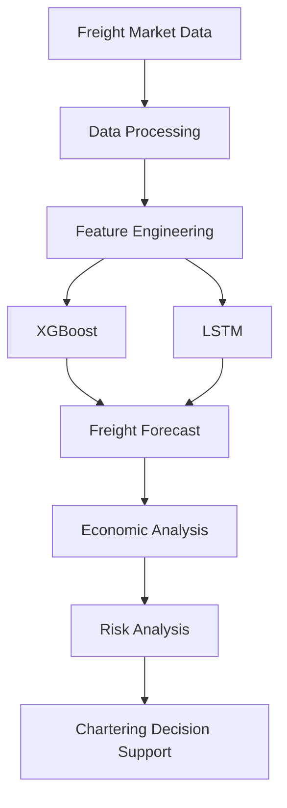
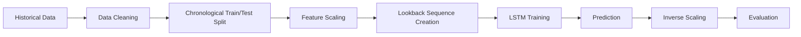
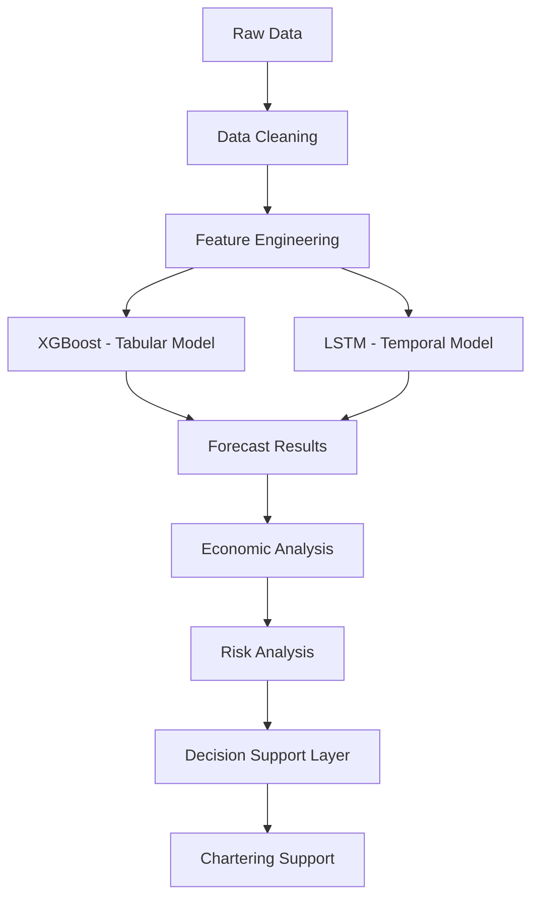
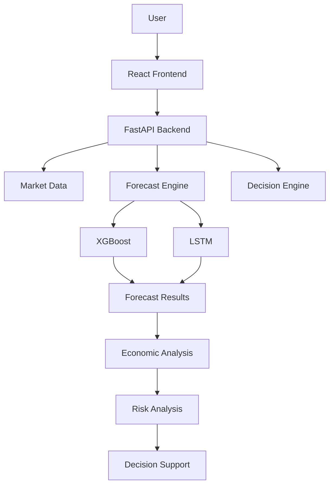

# 🚢 PortCast — AI-Powered Dry Bulk Freight Forecasting & Chartering Decision Support

> An AI-powered dry bulk freight forecasting and decision-support system that combines market data, time-series machine learning, vessel economics, cargo intelligence, and risk analysis to support smarter chartering decisions.


---

## 📌 Overview

**PortCast** is an AI-powered freight intelligence and decision-support platform developed as part of the **Smart India Hackathon (SIH)**.

The system forecasts future dry bulk freight rates and combines those forecasts with vessel information, cargo data, fuel prices, trade information, economic analysis, and risk indicators to support chartering decisions.

### Core Pipeline



---

## 🎯 Problem Statement

The dry bulk shipping market is highly dynamic and influenced by multiple factors:

- Freight-rate fluctuations
- Cargo demand
- Commodity movements
- Port activity
- International trade
- Fuel prices
- Vessel characteristics
- Market volatility
- Supply and demand conditions

Traditional chartering decisions can depend heavily on historical market information and manual analysis.

PortCast aims to provide a unified AI-driven system that can:

- Analyze historical freight-market data
- Engineer meaningful time-series features
- Forecast future freight rates
- Analyze vessel and voyage economics
- Incorporate cargo and market information
- Assess risk-related signals
- Provide chartering decision support

---

## 🚀 Key Features

### 📈 1. Freight Rate Forecasting

PortCast uses historical freight-market information to forecast future freight rates. The project explores multiple forecasting horizons:

| Horizon |
|---------|
| 7 observations |
| 30 observations |
| 60 observations |
| 90 observations |

Future targets are generated using shifted observations:

```python
df["Target_7D"]  = df["KDCI"].shift(-7)
df["Target_30D"] = df["KDCI"].shift(-30)
df["Target_60D"] = df["KDCI"].shift(-60)
df["Target_90D"] = df["KDCI"].shift(-90)
```

> **Note:** These targets are generated using row/observation shifts. They represent future observations and should only be described as exact calendar-day forecasts when the underlying data has a continuous daily frequency.

### 🤖 2. Machine Learning Models

#### XGBoost

Used as a tabular-data forecasting baseline.

```
Historical Freight Data → Feature Engineering → (Lag Features, Rolling Statistics, Temporal Features) → XGBoost → Freight Forecast
```

#### LSTM

Used to capture sequential and temporal patterns in freight-rate data.

```
Input Sequence
   ↓
LSTM (128)
   ↓
Dropout (0.2)
   ↓
LSTM (64)
   ↓
Dropout (0.2)
   ↓
Dense (32, ReLU)
   ↓
Dense (1)
   ↓
Forecast
```

Separate LSTM models are trained for each forecasting horizon.

### 🚢 3. Vessel Recommendation

Forecasting freight rates alone is not sufficient for a complete chartering decision. PortCast combines forecast information with:

- Vessel characteristics
- Cargo requirements
- Forecast freight rates
- Voyage economics
- Fuel costs
- Market conditions
- Risk indicators

The objective is to connect freight forecasting with the operational context of vessel chartering.

### 💰 4. Economic Analysis

The economic layer evaluates the financial implications of a potential voyage or chartering decision.

```
Freight Revenue → Voyage Economics → Fuel Costs → Operating / Voyage Costs → Estimated Economic Outcome
```

This moves the system from *"What will the freight rate be?"* towards *"What could the forecast mean for the chartering decision?"*

### ⚠️ 5. Risk Analysis

Freight markets are uncertain and forecasts are not guaranteed. PortCast considers signals such as:

- Forecast movement
- Historical volatility
- Market conditions
- Forecast uncertainty
- Economic indicators

The risk layer is intended to **support** decisions rather than treat model predictions as guaranteed outcomes.

### 📊 6. Opportunity Score

The prototype includes an opportunity-scoring mechanism.

**Example prototype output:**

```
Current Rate:      19,506
Forecast:          23,692.83
Forecast Change:   +21.46%
Confidence:        41.27%
Opportunity Score: 74.82
Recommendation:    MONITOR
```

> The confidence and opportunity-score mechanisms are prototype heuristics and require further statistical validation before real-world commercial use.

---

## 📊 Data Sources

| Source | Description |
|--------|-------------|
| 🚢 **Freight Market Data** | KOBC freight-market data is the primary market signal. Prototype dataset: ~2,573 observations, ~10 years of history. KDCI-related freight-rate information forms the foundation of the pipeline. |
| 🇮🇳 **Indian Port Cargo Data** | Cargo movement, port activity, commodity flows, demand conditions |
| 🌾 **Commodity Data** | Demand-side signals that can influence dry bulk shipping activity |
| 🌍 **UN Comtrade** | Imports, exports, commodity trade flows, country-level trade activity |
| 🛢️ **Brent / Fuel Price Data** | Fuel prices directly affect voyage profitability |

---

## 🧮 Feature Engineering

**Temporal features:** Year, Month, Quarter, Day of Week

**Lag features:** KDCI Lag 1, Lag 7, Lag 14, Lag 30

**Rolling features:** 7-period and 30-period moving averages; 7-period and 30-period rolling standard deviations

These features help capture recent market trends, momentum, short-term volatility, and longer-term market behavior.

---

## 🔬 Data Preprocessing

The LSTM pipeline follows a chronological time-series workflow:



- Approximately **80/20 chronological** train/test split
- **Lookback window of 30 observations** for the LSTM models
- The scaler is fitted on the training data only, then applied to the test data

**Min-Max Scaling**

$$
X_{scaled} = \frac{X - X_{min}}{X_{max} - X_{min}}
$$

---

## 📈 XGBoost Baseline Results

| Metric | Result |
|--------|--------|
| MAE | 1863.10 |
| RMSE | 2283.88 |
| MAPE | 10.46% |
| R² | 0.596 |

> ⚠️ These results represent the prototype baseline. Some supporting port, commodity, fuel, and trade features used during development contained dummy or repeated values, so these results **should not be interpreted as production-level performance**.

---

## 📊 Evaluation Metrics

**MAE — Mean Absolute Error**

$$
MAE = \frac{1}{n}\sum_{i=1}^{n}|y_i-\hat{y_i}|
$$

**RMSE — Root Mean Squared Error** (penalizes larger errors more strongly)

$$
RMSE = \sqrt{\frac{1}{n}\sum_{i=1}^{n}(y_i-\hat{y_i})^2}
$$

**MAPE — Mean Absolute Percentage Error**

$$
MAPE = \frac{100}{n}\sum_{i=1}^{n}\left|\frac{y_i-\hat{y_i}}{y_i}\right|
$$

**R² Score** — proportion of variance explained by the model relative to a baseline.

---

## 🔄 Complete Forecasting Pipeline



---

## 🏗️ System Architecture



---

## 🧰 Technology Stack

| Layer | Technologies |
|-------|--------------|
| **Machine Learning** | Python, Pandas, NumPy, Scikit-learn, XGBoost, TensorFlow, Keras, Joblib |
| **Backend** | FastAPI, Uvicorn, Python, REST APIs |
| **Frontend** | React, JavaScript, Axios, Vite |
| **Data Processing** | Pandas, NumPy, time-series feature engineering, Min-Max scaling |

---

## 📁 Project Structure

```
PortCast/
│
├── data/
│   ├── freight/
│   ├── ports/
│   ├── commodities/
│   ├── trade/
│   └── fuel/
│
├── notebooks/
│   ├── data_analysis.ipynb
│   ├── xgboost_model.ipynb
│   └── lstm_model.ipynb
│
├── models/
│   ├── lstm_7d.keras
│   ├── lstm_30d.keras
│   ├── lstm_60d.keras
│   ├── lstm_90d.keras
│   ├── X_scaler.pkl
│   └── y_scaler.pkl
│
├── backend/
│   ├── main.py
│   ├── routes/
│   │   ├── market.py
│   │   ├── forecast.py
│   │   ├── vessel.py
│   │   ├── economics.py
│   │   └── decision.py
│   └── services/
│
├── frontend/
│   ├── src/
│   ├── package.json
│   └── vite.config.js
│
├── requirements.txt
├── .gitignore
└── README.md
```

---

## 🔌 API Endpoints

| Module | Endpoint | Description |
|--------|----------|-------------|
| Market | `GET /market/current` | Returns current market information |
| Forecast | `GET /forecast` | Returns freight-rate forecasts generated by the ML models |
| Vessel | `GET /vessel/recommend` | Provides vessel-related decision support |
| Economics | `GET /economics` | Provides economic and voyage-related calculations |
| Decision | `GET /decision` | Combines forecasting, economics, vessel information, and risk signals into a decision-support output |

---

## 💾 Model Saving

LSTM models are saved separately for each forecasting horizon:

```python
model.save("models/lstm_7d.keras")
model.save("models/lstm_30d.keras")
model.save("models/lstm_60d.keras")
model.save("models/lstm_90d.keras")
```

Scalers are saved using Joblib:

```python
import joblib

joblib.dump(X_scaler, "models/X_scaler.pkl")
joblib.dump(y_scaler, "models/y_scaler.pkl")
```

---

## 🔍 Model Comparison

| Model | Primary Use | Main Strength |
|-------|-------------|---------------|
| XGBoost | Tabular forecasting | Nonlinear feature relationships |
| LSTM | Time-series forecasting | Sequential and temporal patterns |

---

## 🧠 Machine Learning Concepts Demonstrated

- Time-Series Forecasting
- Supervised Learning & Regression
- XGBoost & LSTM Networks
- Feature Engineering (lag features, rolling statistics)
- Min-Max Scaling
- Chronological Train/Test Splitting
- Model Evaluation
- Multi-Horizon Forecasting
- Decision Intelligence

---

## 🚀 Installation & Setup

### 1. Clone the repository

```bash
git clone https://github.com/YOUR_USERNAME/PortCast.git
cd PortCast
```

### 2. Create a virtual environment

**Windows**

```bash
python -m venv venv
venv\Scripts\activate
```

**Linux / macOS**

```bash
python3 -m venv venv
source venv/bin/activate
```

### 3. Install dependencies

```bash
pip install -r requirements.txt
```

### 4. Start the FastAPI backend

```bash
uvicorn backend.main:app --reload
```

- Backend: http://127.0.0.1:8000
- API docs: http://127.0.0.1:8000/docs

### 5. Start the React frontend

```bash
cd frontend
npm install
npm run dev
```

---

## 🔐 Security

Never commit API keys, passwords, or environment variables.

Recommended `.gitignore`:

```
.env
venv/
__pycache__/
*.pyc
```

---

## 🧪 Current Limitations

PortCast is currently a **research and prototype system**.

1. **External data quality** — Some port, commodity, fuel, and trade features used during prototyping contained dummy or repeated values. Their contribution to predictive performance should not be interpreted as validated real-world predictive power.
2. **Forecast horizons** — Targets are generated with `shift(-7)`, `shift(-30)`, `shift(-60)`, and `shift(-90)`, which represent future *observations* in the dataset, not guaranteed calendar days.
3. **Opportunity score** — The score and confidence logic are prototype heuristics. A production version would require statistical validation, historical backtesting, confidence calibration, and domain-expert validation.
4. **Production deployment** — Would require larger datasets, reliable real-time data, complete vessel information, robust backtesting, data-quality validation, model monitoring, data-drift detection, and production-grade APIs.

---

## 🔮 Future Improvements

**📊 Data**
- Live freight-rate feeds
- Real-time port congestion data
- AIS vessel tracking
- Real-time bunker fuel prices
- Improved commodity and international trade datasets
- Weather and maritime-condition data

**🤖 Machine Learning**
- Temporal Fusion Transformers
- Transformer-based time-series models
- N-BEATS
- Ensemble forecasting & model stacking
- Probabilistic forecasting and prediction intervals
- Automated hyperparameter optimization

**🚢 Decision Intelligence**
- Advanced vessel-cargo matching
- Voyage-level profitability optimization
- Route optimization
- Scenario analysis
- Dynamic risk scoring
- Uncertainty-aware recommendations

**⚙️ Production**
- Docker and cloud deployment
- MLflow experiment tracking
- Automated model retraining
- Model monitoring and data-drift detection
- Automated ETL pipelines
- Real-time inference

---

## 📚 End-to-End Workflow

1. Collect freight market, port & cargo, commodity, trade, and fuel/economic data
2. Clean and integrate datasets
3. Exploratory data analysis
4. Create temporal features, lag features, and rolling statistics
5. Create future forecast targets
6. Chronological train/test split
7. Train XGBoost baseline
8. Train LSTM models
9. Evaluate forecasts and generate forecast
10. Economic analysis → Risk analysis → Decision support
11. API integration
12. Frontend visualization

---

## 📌 Project Status

**Status: Prototype / Research Project**

- ✅ Freight-rate data processing
- ✅ Time-series feature engineering
- ✅ XGBoost baseline
- ✅ LSTM forecasting
- ✅ Multi-horizon forecasting
- ✅ Economic analysis
- ✅ Risk / decision layer
- ✅ Vessel recommendation concept
- ✅ FastAPI backend
- ✅ React frontend
- 🔄 Further validation and production data integration required

---

## 🎓 What I Learned

- **Machine Learning:** time-series forecasting, feature engineering, XGBoost, LSTM, model evaluation, data preprocessing
- **Data Engineering:** combining multiple datasets, data cleaning, temporal/lag/rolling feature creation
- **Backend:** FastAPI, REST API development, modular architecture, ML model serving
- **Frontend:** React, API integration, data visualization, decision-support interfaces
- **System Design:** end-to-end ML pipelines, model integration, forecasting services, economic analysis, risk-aware decision support

---

## 🌟 Why PortCast?

Traditional forecasting asks: *"What might the freight rate be?"*

PortCast goes further:

- What might the freight rate be?
- How could it affect voyage economics?
- What vessel and cargo context matters?
- What risk signals should be considered?
- **How can this information support a chartering decision?**

PortCast is designed as a **decision-support system**, not just a standalone forecasting model.

```
DATA → INFORMATION → FORECAST → ECONOMIC ANALYSIS → RISK → DECISION SUPPORT
```

---

## ⚠️ Disclaimer

PortCast is a research and prototype decision-support system. Forecasts and recommendations are not guaranteed future market outcomes and should not be considered financial, investment, or commercial advice.

Production deployment would require reliable real-time datasets, rigorous historical backtesting, uncertainty calibration, domain-expert validation, and continuous model monitoring.
